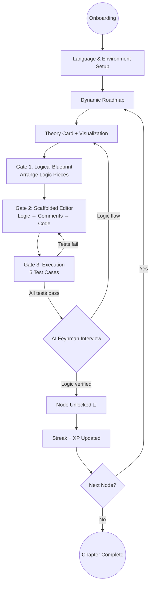

# 🚀 CodeStep: Deep Learning Through Teaching

CodeStep is an AI-driven educational platform designed to help absolute beginners master **C++** and **Java** using the **Feynman Technique**. Unlike traditional platforms that focus on syntax or passing test cases, CodeStep ensures users truly understand the logic behind their code by requiring them to "teach" it to an AI.

---

## 💎 Table of Contents
- [1. The Problem Statement](#-1-the-problem-statement)
- [2. The CodeStep Solution](#-2-the-codestep-solution)
- [3. Target Audience](#-3-target-audience)
- [4. Core Features](#-4-core-features)
- [5. The Learning Journey](#-5-the-learning-journey)
- [6. Technical Architecture](#-6-technical-architecture)
- [7. MVP Implementation Priority](#-7-mvp-implementation-priority)

---

## 🚩 1. The Problem Statement: The "Surface-Level" Trap
Beginners often fall into a cycle of "rote learning" where they can pass exercises but fail to apply logic in real-world scenarios.

| Challenge | Impact on Learners |
| :--- | :--- |
| **Syntax vs. Logic Gap** | Users copy-paste code or use trial-and-error until tests pass without understanding *why*. |
| **Knowledge Decay** | Without a structured review system, foundational concepts are forgotten within 48 hours. |
| **Motivation Loss** | Complex environment setups (compilers, IDEs) and hard-to-debug errors create high friction for absolute beginners. |
| **Lack of Context** | Difficulty translating abstract programming concepts into practical, logical steps. |

---

## 🧠 2. The CodeStep Solution: The Feynman Method
CodeStep leverages the **Feynman Technique**: *If you want to master a concept, explain it to someone else in simple terms.*

The platform acts as the student, and the user acts as the teacher.
- **Unit Tests are just the start**: Passing test cases only proves your code *works*.
- **The Feynman Interview is the Gate**: After passing tests, users enter an AI-powered interview. They must explain their logic, line-by-line, to the AI. If the explanation is sound, the next concept is unlocked.

---

## 👥 3. Target Audience
- **Absolute Beginners**: Individuals with zero coding experience who need a high-accountability, guided path.
- **Logic-Focused Students**: Developers looking to move beyond "coding by rote" toward deep architectural understanding.

---

## ✨ 4. Core Features

### 🛠️ A. Personalized Onboarding
- **Language Introduction**: A guided overview comparing C++ and Java — use cases, syntax philosophy, and career contexts — so users can make an informed choice before committing to a path.
- **Strategic Quiz**: Tailors the roadmap based on goals and current technical aptitude.
- **Environment Sync**: Step-by-step guided setup for local IDEs (VS Code) to bridge web learning and professional tools.

### 💻 B. The Mastery Experience — The 3-Gate Practice Flow

Each practice node follows a structured 3-gate flow designed to build genuine understanding before writing a single line of code.

#### Gate 1 — The Logical Blueprint
When a user enters a practice problem, the code editor on the right is locked/dimmed. Instead, they are presented with a set of **Logic Pieces** — pseudocode fragments or logical steps for solving the problem — displayed in a drag-and-drop panel. The user must arrange these pieces into the correct logical order before the editor unlocks.

*This gate forces the user to think through the problem algorithmically before touching syntax.*

#### Gate 2 — Scaffolded Editor
Once Gate 1 is passed, the editor unlocks — but it is not blank. The Logic Pieces the user arranged are automatically converted into **comment lines** pre-populated in the editor, serving as a structured scaffold. The user then writes the actual code beneath each comment.

*This bridges the gap between "knowing the steps" and "expressing them in code."*

#### Gate 3 — Execution & Testing (The LeetCode Experience)
With the scaffold in place, users enter a full LeetCode-style execution environment. Code is run against **5 test cases**, results are shown in real time, and edge cases are revealed progressively. After passing all test cases, the user proceeds to the Feynman Interview.

*This stage is the familiar, confidence-building execution loop.*

### 🤖 C. AI Feynman Interview
The "Unlock" gate after passing all tests. The AI acts as a curious student and asks the user to explain their logic — line by line, in plain language. Questions are targeted based on the user's specific implementation. If the explanation reveals a logic flaw, the user is sent back to review the concept. Only a sound explanation unlocks the next node.

*After a set number of failed attempts, the AI provides a context-aware hint based on the user's knowledge history.*

### 📊 D. Content & Visualization
- **Theory Cards**: Paired with each concept node — clear theory with concrete examples presented in a consistent, digestible style.
- **Visual Explanations**: Each example is accompanied by a step-by-step visualization (animated or diagram-based) so users can *see* what the code is doing, not just read about it.
- **Dynamic Roadmap**: An interactive visual map of the learning path where nodes unlock sequentially. Users can track progress at a glance.

### 🏆 E. Motivation & Retention
- **Streak System**: Users earn a streak by completing at least one full node (Theory → Tests → Feynman Interview) per day. Maintaining streaks is the primary engagement driver.
- **Soft Daily Deadline**: Users are encouraged (never punished) to complete a target number of nodes per day (e.g., 2 nodes/day) for a sense of consistent achievement.
- **XP & Badges**: Additional reward layers for completing chapters, maintaining streaks, and acing Feynman Interviews on the first attempt.

---

## 🗺️ 5. The Learning Journey

---

## 🏗️ 6. Technical Architecture

| Component | Technology |
| :--- | :--- |
| **Frontend** | React 19, TypeScript, Vite, Tailwind CSS v4 |
| **Backend** | ExpressJS (Node.js), TypeScript |
| **Database** | MongoDB (User data, Progress, Roadmap) |
| **AI Engine** | OpenAI API (GPT-4o) |
| **Execution** | Specialized Code Execution API (C++/Java) |

---

## 🎯 7. MVP Implementation Priority

1. **Auth & Persistence**: Secure user login and progress tracking in MongoDB.
2. **3-Gate Practice Flow**: Logic Blueprint drag-and-drop → Scaffolded Editor → LeetCode-style execution with 5 test cases.
3. **Feynman Interview Logic**: Prompt engineering the AI to act as a challenging but encouraging "interviewer," with context-aware hints after repeated failures.
4. **Roadmap Visualization**: Building the interactive SVG/Canvas roadmap UI with sequential node unlocking.
5. **Theory Cards + Visualizations**: Content framework with consistent style and per-example visual explanations.
6. **Streak & Reward System**: Daily streak tracking tied to node completion, soft daily targets, XP, and badges.

---
